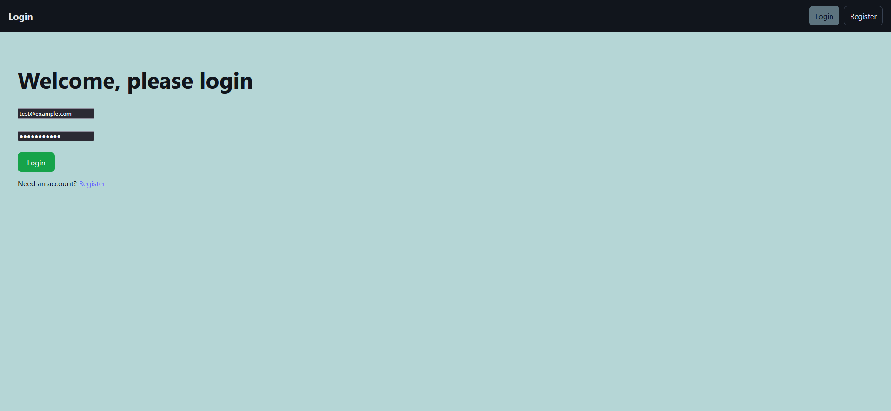
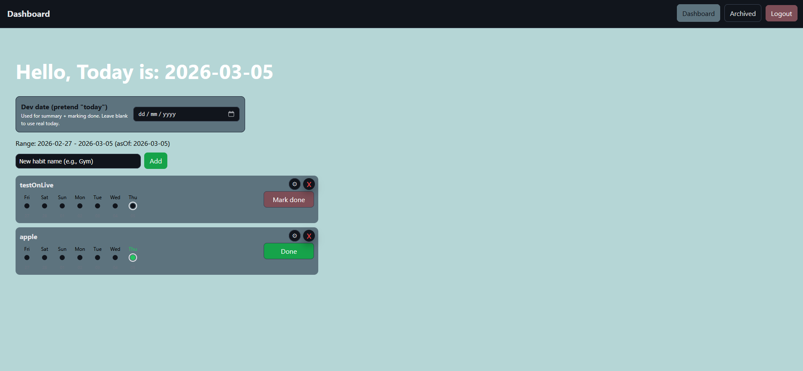

# Habit Tracker — Full Stack Web Application

A full-stack habit tracking application that allows users to create daily habits, track completions, and monitor streaks.
Built with a React frontend, Node.js/Express backend, and PostgreSQL database, deployed using Vercel and Render.

## Features

- User authentication with JWT
- Create and manage daily habits
- Mark habits as complete or incomplete
- Habit streak tracking
- 7-day completion history
- REST API backend

## Live Demo

Frontend: https://habit-tracker-sandy-gamma.vercel.app  
Backend API: https://habit-tracker-jt0s.onrender.com

## Screenshots

### Login 

### Dashboard

## Tech Stack

Frontend
- React
- Vite
- Fetch API
- CSS

Backend
- Node.js
- Express
- JWT Authentication
- PostgreSQL

Infrastructure
- Neon (Postgres hosting)
- Render (API deployment)
- Vercel (frontend deployment)

## Architecture

React (Vercel)
      ↓
Express API (Render)
      ↓
PostgreSQL (Neon)
